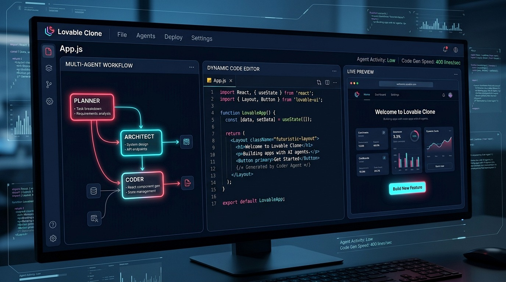

# 🕷️ Gudla Vishal — Spider-Verse 3D Cyber Portfolio

<div align="center">



### **Cybersecurity Student & AI Engineer | Full-Stack Developer | Team Lead**
*Hyderabad, Telangana, India*

[](https://github.com/GudlaVishal-23/vishal-gudla-portfolio)
[](https://github.com/GudlaVishal-23)
[](https://www.linkedin.com/in/vishalgudla/)
[](LICENSE)

</div>

---

## ⚡ Overview

A high-performance, dynamic **Spider-Verse comic-styled 3D developer portfolio** crafted for **Gudla Vishal** — showcasing mission logs across **Cybersecurity, Multi-Agent AI systems, Computer Vision, and Full-Stack Web Development**.

The portfolio merges modern comic book aesthetics (Ben-Day halftone patterns, bold ink borders, tactical HUD widgets) with WebGL shaders, Three.js 3D physics, and an HTML5 Canvas Pixel-by-Pixel Matrix Morph Transition Engine.

---

## ✨ Key Architectural Features

### 1. 🔲 Pixel-by-Pixel Matrix Morph Transition Engine
- **Custom Slicing Grid:** Splits hero images into **~1,500 responsive digital square blocks** (13px–16px tiles) on a dedicated HTML5 Canvas overlay.
- **Staggered Wave Algorithm:** Calculates Pythagorean distance from the click point ($d = \sqrt{\Delta x^2 + \Delta y^2}$) to stagger particle disintegration waves.
- **Particle Sparks & Physics:** Emits glowing crimson and white particle sparks with velocity, friction, and fade physics.
- **Live HUD Reconstruction Progress:** Displays real-time `RECONSTRUCTING PIXELS: 0% → 100%` ticker while toggling between the **Spider Cyber-Mask** and the **Real Portrait**.

### 2. 🕸️ Interactive Force-Directed Skill Web Graph
- **Dynamic Physics Engine:** Canvas-based interactive node graph simulating spring tension, hover magnetics, and connective glowing spiderwebs.
- **Category Filter Matrix:** Instant filtering across **Cybersecurity**, **AI & Machine Learning**, **Full-Stack Development**, and **Cloud & Enterprise**.

### 3. 🌌 WebGL Custom Shader & Three.js 3D Emblem
- Real-time animated GLSL shader background rendering cosmic Spider-Verse grids and particles.
- Floating Three.js 3D Spider Emblem interacting dynamically with mouse coordinates.

### 4. 🔊 Tactical HUD Sound System
- Web Audio API synthesizer generating real-time mechanical click, web-thwip, and energy blast audio feedback on interactive elements.

---

## 🗺️ Portfolio Sections

```
├── 🕷️ Home // Overview (WebGL Hero + Pixel Matrix Morph Engine + HUD Ticker)
├── 📜 Origin Story (Identity Dossier & Sphoorthy Engg Suit Portrait)
├── 💼 Work Experience (School of Computing Teaching Intern & SmartBridge Salesforce Champion)
├── 🕸️ Skill Web (Force-Directed Tech Stack Node Graph)
├── 🚀 Deployments (Featured Mission Log & Engineering Projects)
├── 🏆 Accolades (MSME Ideathon Winner, Mind Sports Excellence & Certifications)
├── 🌟 Leadership & Events (LMS Launch & Faculty Demo, HR Conclave 2025, Hackathons)
├── 🎓 Academic Foundation (B.Tech in Cybersecurity at Sphoorthy Engineering College)
└── 📡 Tactical Signal (Interactive Terminal Comms Form)
```

---

## 💻 Featured Deployments

| Project | Tech Stack | Highlights | Links |
| :--- | :--- | :--- | :--- |
| **1. Lovable Clone** | `LangGraph`, `LangChain`, `Groq`, `Python`, `React` | Multi-Agent AI app builder where specialized agents (*Planner*, *Architect*, *Coder*) autonomously generate full-stack apps from natural language prompts. | [Source Code](https://github.com/GudlaVishal-23/lovable-clone) |
| **2. AVATARAX** | `OpenCV`, `MediaPipe`, `Python`, `NumPy` | Controller-free elemental battle system using real-time computer vision to track hand landmarks and cast fire/energy attacks at 60+ FPS (<50ms latency). | [Live Engine](https://github.com/GudlaVishal-23) |
| **3. NearbyNode 🌐** | `React.js`, `Node.js`, `MongoDB`, `Firebase`, `Stripe` | Trust-driven C2C marketplace for informal local sellers featuring simulated Aadhaar KYC, dynamic Trust Score (98%), and fraud protection. | [Live Demo](https://nearbynode.netlify.app/) • [GitHub](https://github.com/GudlaVishal-23/nearbynode) |
| **4. School of Computing LMS** | `React`, `Node.js`, `MongoDB`, `Chart.js` | In-house institutional LMS platform with student learning analytics, logic-building progress trackers, and faculty course management portals. | [Architecture](https://github.com/GudlaVishal-23) |

---

## 🏆 Honors, Awards & Leadership

- **🥇 MSME Ideathon 6.0 Winner:** Awarded by the Ministry of MSME, Govt. of India for the *"Best Idea for Social Impact"* during the 36-hour national ideathon.
- **♟️ Certificate of Excellence (Mind Sports Activity):** Awarded by the School of Computing (Winning House Core Coders) for logical thinking, strategic decision-making, and competitive problem-solving.
- **⚡ Salesforce Agentblazer Champion:** Recognized by Salesforce & AICTE for excellence in Apex, Lightning Web Components (LWC), and platform fundamentals.
- **🚀 SOC LMS Launch & Faculty Demonstration:** Coordinated the launch event and conducted the live platform demonstration to all institutional faculty members and college leadership.
- **👔 HR Conclave 2025 Logistics Leadership:** Managed emergency transportation operations for visiting corporate HR leaders during a city-wide cab strike, ensuring 100% executive presence.

---

## 📁 Repository Structure

```
spidport/
├── index.html              # Main Spider-Verse Portfolio Markup
├── style.css               # Comic Aesthetics, Halftone Grids & Responsive Styles
├── app.js                  # WebGL, Three.js 3D Emblem, Skill Web & Pixel Morph Engine
├── mask-image.png          # Hero Split Cyber-Mask Graphic
├── real-photo.jpg          # Hero Real Portrait Photo
├── origin-photo.jpg        # Origin Story Dossier Suit Portrait
├── msme-award.jpg          # MSME Ideathon 6.0 Award Ceremony Photo
├── mind-sports-cert.jpg    # Certificate of Excellence (Mind Sports Activity)
├── lms-launch.jpg          # SOC LMS Inauguration & Faculty Demo Photo
├── hr-conclave.jpg         # HR Conclave Corporate Delegation Photo
├── project-lovable.jpg     # Lovable Clone Project Preview
├── project-avatarax.jpg    # AVATARAX Computer Vision Project Preview
├── project-nearbynode.jpg  # NearbyNode Marketplace Project Preview
├── project-lms.jpg         # School of Computing LMS Project Preview
└── README.md               # Project Documentation & Architecture Guide
```

---

## 🚀 Quick Start / Local Setup

To run the portfolio locally on your machine:

```bash
# 1. Clone the repository
git clone https://github.com/GudlaVishal-23/vishal-gudla-portfolio.git

# 2. Navigate to the project directory
cd vishal-gudla-portfolio

# 3. Launch a static server (or use VS Code Live Server)
# Using Python:
python -m http.server 3000

# Using Node / npx:
npx serve .
```

Open your browser at `http://localhost:3000` to explore the portfolio!

---

## 🛠️ Built With

- **HTML5 & Vanilla JavaScript (ES6+)**
- **Vanilla CSS3** with custom comic utility tokens & responsive layouts
- **Three.js** (3D WebGL Rendering & Math Physics)
- **HTML5 Canvas API** (Pixel Matrix Slicing & Particle Spark Physics)
- **FontAwesome 6** & **Material Symbols**
- **Google Fonts** (*Montserrat*, *Inter*, *Fira Code*)

---

## 📬 Connect with Me

- 🌐 **Portfolio:** [https://nearbynode.netlify.app/](https://nearbynode.netlify.app/)
- 💼 **LinkedIn:** [linkedin.com/in/vishalgudla](https://www.linkedin.com/in/vishalgudla/)
- 💻 **GitHub:** [github.com/GudlaVishal-23](https://github.com/GudlaVishal-23)
- 📧 **Email:** [vishalgudla2@gmail.com](mailto:vishalgudla2@gmail.com)

---

<div align="center">

**Approved by the Comics Code Authority &bull; Designed & Built with ❤️ by Gudla Vishal**

</div>